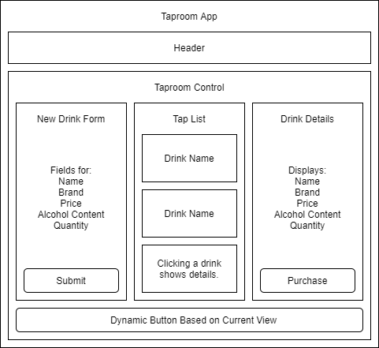

# Taproom
JohnNils Olson  
September 18th, 2020 - Epicodus Week 18
## A practice in using React.js with Redux
### Manage the availability of various drinks on tap in this virtual taproom!

## Technologies Used
* HTML
* CSS
* Bootstrap
* Javascript
* React.js
* Redux

## Specifications
| Behavior | Input | Expected Output |
| ---- | ---- | ---- |
| User is presented with tap list. | - | View is list of drinks on tap. |
| User clicks on drink name. | "Pale Ale" | View changes to "Pale Ale" details. Dynamic button changes to "Return to Drink List". |
| User clicks to buy a pint of drink. | "Purchase" | Drink quantity is reduced by 1. |
| User returns to drink list. | "Return to Drink List" | View changes from drink details to drink list. Dynamic button changes to "Add Drink" |
| User clicks "Add Drink". | "Add Drink" | View changes to add drink form. Dynamic button changes to "Return to Drink List" |
| User adds new drink. | "Submit" | Drink is added to list. View Changes to drink list. Dynamic button changes to "Add Drink" |

## Component Diagram

## Installation Instructions
Cloning instructions.
  1. Open Git Bash.
  2. Change the current working directory to the location where you would like to clone the repository.
  3. Type "git clone" followed by "https://github.com/JohnNilsOlson/taproom" (without quotes) and hit enter.

OR

Download instructions.
  1. Visit https://github.com/JohnNilsOlson/taproom
  2. Click on the green "Code" button.
  3. Click on the "Download zip" button.
  4. Extract zip file to directory of choice.

## Available Scripts

This project was bootstrapped with [Create React App](https://github.com/facebook/create-react-app).

In the project directory, you can run:

| Script | Description | Notes |
| ---- | ---- | ---- |
| npm start | Runs the app in the development mode. | |
| npm test | Launches the test runner in the interactive watch mode. | |
| npm run build | Builds the app for production to the build folder.| |
| npm run eject | Removes the single build dependency from your project. | This is a one-way operation. Once you eject, you can’t go back! |

You can learn more in the [Create React App documentation](https://facebook.github.io/create-react-app/docs/getting-started).

## Bugs
No known issues.

## Contact Information
JohnNils Olson - johnnils@gmail.com

## License
The [MIT] license.
Copyright (c) 2020 JohnNils Olson
